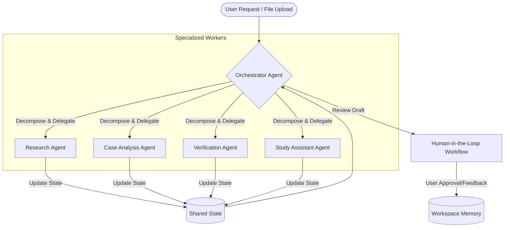

# Agentic Architecture and Course Alignment Addendum
## Kaggle + Google AI Agents Intensive Capstone Project: LexAgent

---

## 1. Why LexAgent Is An Agent System Rather Than A Chatbot

LexAgent is not a basic wrappers-over-LLM chatbot. A chatbot operates in a simple, single-prompt input/output loop, where a single large language model is expected to perform retrieval, synthesis, formatting, verification, and pedagogy simultaneously. This monolithic design fails in complex domains like Indian law, where it suffers from context-window exhaustion, severe hallucination of case citations, and lack of structured focus.

In contrast, LexAgent is built as an **Agentic System** that decomposes the legal research and study problem into a network of specialized, collaborative, autonomous agents.



### 1.1 Task Decomposition
A user's intent—such as *"Create a study guide for my contract law exam based on Section 56 cases and check if the judgments are still active"*—is too complex for a single prompt. LexAgent's Orchestrator decomposes this request into distinct, sequentially dependent goals:
1. Search and retrieve relevant judgments regarding Section 56 (Contract Law).
2. Read, segment, and structure each judgment into standard FIRAC components.
3. Validate every citation mentioned in the judgments against external legal registries.
4. Synthesize the verified information into revision notes.
5. Generate practice quizzes and active-recall flashcards from those notes.

### 1.2 Agent Orchestration
The system coordinates these tasks using a **State-Graph Orchestrator** framework. The Orchestrator does not follow a rigid hard-coded script. It dynamically decides which agent to invoke next based on the current state of the request. If the Verification Agent reports that a case citation is invalid or overruled, the Orchestrator dynamically routes the task back to the Research Agent to locate alternative active precedents.

### 1.3 Specialized Responsibilities
By assigning single, narrow roles to individual agents, we maximize accuracy:
* **Research Agent**: Expert at query refinement, semantic search, and statutory mappings. It only interacts with search tools and database indexes.
* **Case Analysis Agent**: Operates with a long context window to read, synthesize, and extract key arguments and legal reasoning (Ratio Decidendi) from lengthy PDFs.
* **Verification Agent**: Exclusively responsible for trust validation. It extracts citations and runs verification tools to query court registries, checking if a case is still active.
* **Study Assistant Agent**: Tailored to educational pedagogy. It translates complex legal records into revision materials, multiple-choice questions (MCQs), and flashcards.

### 1.4 Agent Collaboration
Agents interact via a shared state. The outputs of the Research Agent (case files) feed directly into the Case Analysis Agent, whose outputs (citations) feed into the Verification Agent. Finally, the Study Assistant Agent consumes only the *verified* legal arguments, ensuring that students never study flashcards based on overruled cases or hallucinated rulings.

---

## 2. MCP (Model Context Protocol) Architecture

To decouple the core reasoning models from data access layers, LexAgent implements a **Model Context Protocol (MCP)** architecture. Rather than building proprietary, ad-hoc integrations for databases, web APIs, and local directories, LexAgent agents interact with data repositories via standardized MCP servers.

```
┌────────────────────────────────────────────────────────┐
│                   LEXAGENT INTERNALS                    │
│  ┌──────────────────┐            ┌──────────────────┐  │
│  │  Research Agent  │            │  Verification    │  │
│  └────────┬─────────┘            └────────┬─────────┘  │
└───────────┼───────────────────────────────┼────────────┘
            │ (MCP JSON-RPC)                │ (MCP JSON-RPC)
            ▼                               ▼
┌────────────────────────────────────────────────────────┐
│                    MCP GATEWAY                         │
│  ┌──────────────────┐ ┌──────────────────┐ ┌─────────┐ │
│  │ Legal Docs Server│ │ Statutes Server  │ │Workspace│ │
│  └──────────────────┘ └──────────────────┘ └─────────┘ │
└────────────────────────────────────────────────────────┘
```

### 2.1 Legal Documents MCP Server
Exposes the student's uploaded judgments, scanned briefs, and raw legal texts.
* **Resources Exposed**:
  * `lexagent://documents/list`: Returns a directory of uploaded case judgments.
  * `lexagent://documents/{doc_id}/raw`: Exposes the raw extracted text of a judgment.
  * `lexagent://documents/{doc_id}/metadata`: Metadata containing court, judge count, year, and party names.
* **Tools Exposed**:
  * `parse_pdf_document(file_path)`: Runs OCR and cleans headers, footers, and marginalia.
  * `search_document_chunks(doc_id, query)`: Vector search over the specific document to retrieve matching paragraphs.
* **Accessed By**: *Case Analysis Agent* (to read the raw text of judgments) and *Verification Agent* (to fetch metadata for validation).

### 2.2 Indian Statutes MCP Server
Provides structured access to official central acts, articles, amendments, and rules.
* **Resources Exposed**:
  * `statutes://acts/list`: List of all available central acts.
  * `statutes://{act_name}/section/{section_number}`: Exposes the exact, current text of a specific statutory section (e.g., `statutes://contract-act/section/56`).
  * `statutes://constitutional-articles/article/{article_number}`: Exposes the text of a specific article of the Constitution of India.
* **Tools Exposed**:
  * `get_amendment_history(act_name, section)`: Returns the historical amendments made to a specific section.
  * `find_matching_statutes(query)`: Semantic search to map user queries to relevant sections across acts.
* **Accessed By**: *Research Agent* (to map user queries to exact statutes) and *Verification Agent* (to cross-check if the statutory references are current).

### 2.3 Research Workspace MCP Server
Manages the user’s personal workspace state, including notes, drafts, bookmarks, and flashcard decks.
* **Resources Exposed**:
  * `workspace://notes/{note_id}`: Saved study notes.
  * `workspace://flashcards/decks`: User's flashcard decks.
  * `workspace://user/profile`: User's target exams (e.g., Delhi Judicial Services) and syllabus preferences.
* **Tools Exposed**:
  * `save_brief_draft(title, content)`: Saves a case brief draft to the user's workspace.
  * `append_to_note(note_id, content)`: Appends information to active study notes.
  * `create_flashcard_deck(title, cards)`: Stores generated flashcards.
* **Accessed By**: *Orchestrator Agent* (to fetch user preferences), *Study Assistant Agent* (to save study materials), and *Human Review Agent* (to write approved documents to long-term memory).

### 2.4 Why MCP is Preferable to Direct Integrations
1. **Decoupled Architecture**: If the statutory database changes from a local SQLite database to an external government API, only the Indian Statutes MCP Server needs to be updated. The LLM agents remain completely untouched.
2. **Context Minimization**: Instead of passing the entire Constitution or Contract Act into the agent's context window, the agent uses MCP resources to fetch *only* the specific article or section text needed for the current reasoning step.
3. **Tool Standards**: MCP standardizes how tools are declared, documented, and executed, allowing the agents to work with the same interface regardless of the client runtime environment.

---

## 3. Agent Skills Framework

In LexAgent, an **Agent Skill** is a structured module that equips an agent with specific domain expertise. It is stored as a file directory containing instruction logs (`SKILL.md`) and specialized tool specifications. 

By grouping legal expertise into separate, modular skills, we implement **progressive disclosure**. Instead of overwhelming a model with a massive system prompt containing rules for Contract, Succession, and Constitutional Law all at once (which causes "context rot" and model confusion), the Orchestrator dynamically loads the specific Skill only when a related task is active.

```
lexagent_skills/
├── constitutional_law/
│   ├── SKILL.md
│   └── tools/
├── contract_law/
│   ├── SKILL.md
│   └── tools/
├── consumer_protection/
│   ├── SKILL.md
│   └── tools/
└── succession_law/
    ├── SKILL.md
    └── tools/
```

### 3.1 Constitutional Law Skill
* **Purpose**: Interprets constitutional provisions, fundamental rights, directive principles, amendment histories, and judicial bench structures.
* **Trigger Conditions**: Detected keywords: "Article", "Constitution", "dissenting opinion", "amendment", "Writ", "basic structure", or reference to constitutional landmark cases (e.g., *Kesavananda*, *Maneka Gandhi*, *Puttaswamy*).
* **Knowledge Included**: Mapping of Fundamental Rights (Articles 12-35), Directive Principles (Articles 36-51), Writ Jurisdictions (Articles 32 and 226), and historical amendment details (1st, 24th, 42nd, 44th, 103rd).
* **Tools Included**:
  * `fetch_bench_composition(case_id)`: Retrieves the number of judges on the bench and who wrote the majority/dissenting opinions.
  * `get_article_preamble_evolution(article_num)`: Traces the constituent assembly debates and changes to the article.
* **Example Tasks**: Analyze a recent Supreme Court judgment to determine if it establishes a new precedent altering the scope of Article 21.

#### Example `SKILL.md` Contents
```markdown
# Constitutional Law Domain Expert Skill

## Core Instruction
You are an expert on the Constitution of India. When analyzing constitutional matters:
1. Always identify the exact Article being interpreted.
2. Distinguish between Majority rulings and Dissenting opinions. Constitutional developments in India are heavily influenced by dissents (e.g., Justice Khanna in ADM Jabalpur).
3. Check the Bench size. A larger bench overrules a smaller bench (doctrine of binding precedent).

## Structured Extraction Rules
- Extract the Petitioner's claim under Part III (Fundamental Rights).
- Determine if a state action is challenged as ultra vires the Constitution.
- Document any application of the Basic Structure Doctrine.
```

---

### 3.2 Contract Law Skill
* **Purpose**: Analyzes agreement formations, breaches, consideration, void agreements, indemnity, guarantee, bailment, and agency.
* **Trigger Conditions**: Detected keywords: "agreement", "contract", "breach", "damages", "consideration", "indemnity", "guarantee", "bailment", "frustration of contract", "Section 56", "Section 73", "promissory estoppel".
* **Knowledge Included**: Indian Contract Act, 1872 sections, definitions of proposal/acceptance, rules of void agreements, and liquidated vs unliquidated damages.
* **Tools Included**:
  * `verify_contractual_elements(case_facts)`: Checks the presence of offer, acceptance, lawful consideration, and capacity.
  * `lookup_contract_precedents(section_num)`: Retrieves landmark judgments (e.g., *Carlill v Carbolic Smoke Ball*, *Satyabrata Ghose*) mapping to a specific section.
* **Example Tasks**: Parse a contract dispute judgment and isolate the analysis of whether a force majeure clause or Section 56 (doctrine of frustration) applied.

#### Example `SKILL.md` Contents
```markdown
# Contract Law Domain Expert Skill

## Core Instruction
You are an expert on the Indian Contract Act, 1872. When analyzing contract disputes:
1. Identify the specific sections of the Act involved (commonly Section 2, 10, 25, 56, 73, or 74).
2. Explicitly extract the factual scenario showing if there was a valid offer, acceptance, and consideration.
3. In frustration cases (Sec. 56), determine if the performance became physically impossible or merely commercially unprofitable.

## Structured Extraction Rules
- Isolate the contract terms in dispute.
- Analyze if the damages awarded are liquidated (Sec. 74) or unliquidated (Sec. 73).
- Flag if the contract was declared void ab initio (e.g., minor's agreement).
```

---

### 3.3 Consumer Protection Skill
* **Purpose**: Evaluates product liability, deficiency of service, unfair trade practices, and consumer forum jurisdictions.
* **Trigger Conditions**: Detected keywords: "consumer", "deficiency of service", "unfair trade", "product liability", "misleading advertisement", "Consumer Commission", "district forum".
* **Knowledge Included**: Consumer Protection Act, 2019 (and historical 1986 provisions), definitions of "consumer", commercial purpose exclusions, and pecuniary jurisdictions.
* **Tools Included**:
  * `verify_consumer_status(buyer_details, transaction_purpose)`: Checks if the buyer qualifies as a "consumer" or is excluded under commercial use clauses.
  * `calculate_commission_jurisdiction(claim_value)`: Resolves whether a claim belongs to District, State, or National Commission based on 2019 statutory limits.
* **Example Tasks**: Given a service complaint judgment, check if the court correctly asserted pecuniary jurisdiction under the 2019 amendments.

#### Example `SKILL.md` Contents
```markdown
# Consumer Protection Law Domain Expert Skill

## Core Instruction
You are an expert on the Consumer Protection Act, 2019. When evaluating service or product claims:
1. Validate if the complainant is a "consumer". Exclude transactions made purely for commercial resale.
2. Determine which tier of the Consumer Disputes Redressal Commission holds jurisdiction based on the claim value.
3. Distinguish between 'defect in goods' (Sec. 2(10)) and 'deficiency in service' (Sec. 2(11)).

## Structured Extraction Rules
- Extract the service provider's defense regarding commercial exclusion.
- Document any compensation awarded for mental agony or harassment.
```

---

### 3.4 Succession Law Skill
* **Purpose**: Navigates intestate and testamentary succession, coparcenary rights, wills, partition suits, and devolution rules.
* **Trigger Conditions**: Detected keywords: "will", "probate", "intestate", "heir", "succession certificate", "coparcenary", "partition", "Section 6", "Hindu Succession Act", "Indian Succession Act".
* **Knowledge Included**: Hindu Succession Act, 1956 (specifically the 2005 Amendment impact on daughters' coparcenary rights), Indian Succession Act, 1925 rules on wills.
* **Tools Included**:
  * `calculate_coparcenary_shares(family_tree_json)`: Automates partition share calculations based on classical and amended Hindu succession rules.
  * `validate_will_execution(will_metadata)`: Evaluates attestation rules (number of witnesses, signing intent).
* **Example Tasks**: Evaluate a judgment involving daughter's rights in a partition suit and confirm if it aligns with the Supreme Court's ruling in *Vineeta Sharma v Rakesh Sharma*.

#### Example `SKILL.md` Contents
```markdown
# Succession Law Domain Expert Skill

## Core Instruction
You are an expert on Indian Succession and Inheritance laws. When analyzing family property and will disputes:
1. Identify the governing personal law (e.g., Hindu Succession Act, 1956 or Indian Succession Act, 1925).
2. For Hindu joint family disputes, determine if the property is ancestral (coparcenary) or self-acquired.
3. Apply the 2005 Amendment rules (Section 6 HSA) retroactively or prospectively as defined by current Supreme Court standards.

## Structured Extraction Rules
- Draw a structured diagram of the family relationships and survivors.
- Calculate the exact mathematical shares of each heir upon partition.
```

---

## 4. Agent Interoperability

To ensure smooth operations across the multi-agent system, LexAgent relies on structured state transitions, lightweight message passing, and graceful recovery loops.

### 4.1 Shared State
The multi-agent execution is managed as a state-graph. The shared state is a typed Python dictionary (or JSON schema) representing the context of the user's request. 

```json
{
  "user_query": "Explain how frustration of contract applies to lease agreements according to Supreme Court cases.",
  "active_domain": "contract_law",
  "statutory_references": [
    {"act": "Indian Contract Act, 1872", "section": "56"}
  ],
  "retrieved_cases": [
    {"case_name": "Raja Dhruv Dev Chand v. Raja Harmohinder Singh", "citation": "AIR 1968 SC 1024"}
  ],
  "case_briefs": [],
  "verified_citations": [],
  "study_materials": {
    "revision_notes": "",
    "flashcards": [],
    "quizzes": []
  },
  "agent_errors": []
}
```

### 4.2 Message Passing and Context Transfer
Agents do not communicate by passing entire conversations. Instead, when the Orchestrator moves transitions from one agent node to another:
1. **State Isolation**: The active agent is only provided with the keys of the shared state relevant to its function. For example, the *Verification Agent* is only sent the `retrieved_cases` and `case_briefs` array, not the raw user chat history.
2. **Standardized Appending**: The agent executes its task, outputs its results in a structured format, and appends or merges its results back into the shared state.

### 4.3 Failure Recovery
If an agent fails (due to API timeout, LLM formatting error, or missing tool data):
* **Self-Correction (Retry Loop)**: If the Study Assistant Agent outputs flashcards that fail validation, the Orchestrator routes the output back to the agent with the validation error payload. The agent reads this payload, corrects the structure, and resubmits.
* **Fallback Degradation**: If the Verification Agent cannot connect to the court registry database due to API downtime, it appends a `VerificationWarning` to the state, allowing the workflow to proceed but informing the user that citations could not be checked in real-time.

### 4.4 Example Multi-Agent Interoperability Workflow
Below is the execution trace for: **"Research Section 56 Contract Act and make a quiz."**

```
[Research Agent]
  │
  ├── 1. Receives state: user_query="Section 56 Contract Act"
  ├── 2. Queries 'Indian Statutes MCP' -> retrieves Section 56 text
  ├── 3. Queries 'Legal Documents MCP' -> finds case "Satyabrata Ghose v. Mugneeram"
  └── 4. Writes to State: retrieved_cases, statutory_references
        │
        ▼
[Case Analysis Agent]
  │
  ├── 1. Receives state: retrieved_cases, statutory_references
  ├── 2. Extracts facts, issues, ratio, and citations from judgment raw text
  └── 3. Writes to State: case_briefs=[{ "ratio": "...", "citations": ["AIR 1954 SC 44"] }]
        │
        ▼
[Verification Agent]
  │
  ├── 1. Receives state: case_briefs
  ├── 2. Extracts citation string: "AIR 1954 SC 44"
  ├── 3. Queries official registry API -> validates party names match
  └── 4. Writes to State: verified_citations=[{ "citation": "AIR 1954 SC 44", "status": "VERIFIED_ACTIVE" }]
        │
        ▼
[Study Assistant Agent]
  │
  ├── 1. Receives state: case_briefs, verified_citations
  ├── 2. Generates MCQ quiz questions matching the verified ratio
  └── 3. Writes to State: study_materials={"quizzes": [...], "flashcards": [...]}
```

---

## 5. Flagship Feature: Legal Mentor Mode

### 5.1 Overview
Unlike standard legal AI assistants that perform a single-turn action (e.g., outputting a case brief or summary), **Legal Mentor Mode** is an interactive, multi-turn pedagogical agent workflow designed to teach students how to think like a lawyer. It utilizes the **Socratic Method** to guide students through reading and analyzing case law, preparing them for moot courts, viva-voce, and judicial services examinations.

```
                  [ Student Uploads Kesavananda Bharati ]
                                    │
                                    ▼
                      [ Legal Mentor Mode Active ]
                                    │
                        ┌───────────┴───────────┐
                        ▼                       ▼
              [Socratic Inquiries]      [Evaluates Answers]
              - Asks student to find    - Scores student's response
                the core legal issue.   - Highlights legal errors
                        │                       │
                        └───────────┬───────────┘
                                    ▼
                       [Reinforcement Generator]
                       - Generates personalized MCQs
                       - Spaced repetition flashcards
```

### 5.2 Interactive Walkthrough: *Kesavananda Bharati v. State of Kerala*
When a student activates Legal Mentor Mode and references the judgment, the workflow initiates a structured learning dialogue rather than dumping a massive summary:

* **Step 1: Contextual Setup & Initial Inquiry**
  * *LexAgent (Mentor Mode)*: "You have selected *Kesavananda Bharati (1973)*. This is a massive 13-judge bench decision. Before we look at the ruling, let’s look at the facts. In 1970, the Kerala State Government placed restrictions on the properties of the Edneer Mutt. Which constitutional rights did the petitioner claim were violated by this state action? (Hint: Think about property and religious rights)."
* **Step 2: Student Response & Analysis**
  * *Student*: "I think he claimed violations under Article 19 for freedom of speech and Article 25 for religious freedom."
* **Step 3: Pedagogical Evaluation**
  * *LexAgent (Mentor Mode)*: "You're partially correct. Article 25 (Freedom of Religion) was indeed a major point of contention regarding the Mutt's management. However, Article 19(1)(f) (Right to Property) and Article 31 (Compulsory Acquisition of Property) were the core drivers of this litigation, not freedom of speech. Let's look closer: why did the state's land reform laws directly clash with the right to property? What is your take?"
* **Step 4: Active Recall Assessment & Reinforcement**
  * Once the student demonstrates understanding of the core conflict, LexAgent prompts: "Excellent. Now let's test your recall of the outcome. The Court established the 'Basic Structure Doctrine'. I have generated a 3-question quiz to test your understanding of what falls under this doctrine."

### 5.3 Technical Realization of Mentor Mode
Legal Mentor Mode is powered by a state machine that tracks the student's **Cognitive State**:
1. **State Node: `WAIT_FOR_USER_INPUT`**: Blocks execution and prompts the user with a Socratic question.
2. **State Node: `EVALUATE_RESPONSE`**: The User Input is evaluated by a reasoning model against the verified case brief. It compares the semantic meaning of the student's answer to the *Ratio Decidendi* and *Issues* stored in the case database.
3. **State Node: `REINFORCEMENT`**: Generates flashcards targeting the concepts the student got wrong, tagging them with a spaced-repetition reminder.

### 5.4 Differentiator from Generic Chatbots
* **Active Learning vs. Passive Consumption**: Generic chatbots summarize the case, allowing the student's brain to remain passive. Mentor Mode forces the student to analyze, retrieve from memory, and synthesize arguments.
* **Fact-Checked Pedagogical Loops**: The questions and answers are guided by the *Verification Agent*, ensuring that the AI mentor never validates an incorrect statutory interpretation.

---

## 6. Explicit Course Concept Mapping

The following table explicitly maps LexAgent's product features to the core architectural concepts taught during the **5-Day AI Agents: Intensive Vibe Coding** course:

| Course Day | Core Course Concept | LexAgent Product Implementation | Verification / Proof Location |
| :--- | :--- | :--- | :--- |
| **Day 1** | Prompt Engineering & Structured Outputs | • JSON Schema extraction for FIRAC briefs.<br>• Dynamic prompt templates using domain-specific law instructions. | • `Case Analysis Agent` (Section 9.1)<br>• `Flashcard Generation` (Section 6.6) |
| **Day 2** | Orchestration & Graph Patterns | • State-Graph Orchestrator managing agent transitions.<br>• Parallel execution of Research and Verification nodes.<br>• Dynamic routing based on validation failures. | • `Orchestrator Agent` Workflow (Section 9)<br>• Multi-Agent Coordination (Section 6.10) |
| **Day 3** | Model Context Protocol (MCP) | • `Legal Documents MCP Server` (Uploaded PDFs).<br>• `Indian Statutes MCP Server` (Acts/Amendments).<br>• `Research Workspace MCP Server` (Workspace Notes). | • `MCP Architecture` (Section 2)<br>• Real-time Statutory Retrieval (Section 6.1) |
| **Day 4** | Memory & progressive disclosure | • Semantic search over document vector segments.<br>• Domain-specific `Agent Skills` (Constitutional, Contract, Succession, Consumer Protection).<br>• Dynamic context loading using `SKILL.md` boundaries. | • `Agent Skills Framework` (Section 3)<br>• `Workspace Memory` Architecture (Section 10) |
| **Day 5** | HITL & Trust safety guardrails | • Draft staging queue in `Review Inbox`.<br>• Citation verification engine checks registry APIs.<br>• Trust Confidence Scoring system. | • `Legal Mentor Mode` (Section 5)<br>• `Security and Trust Design` (Section 11) |
