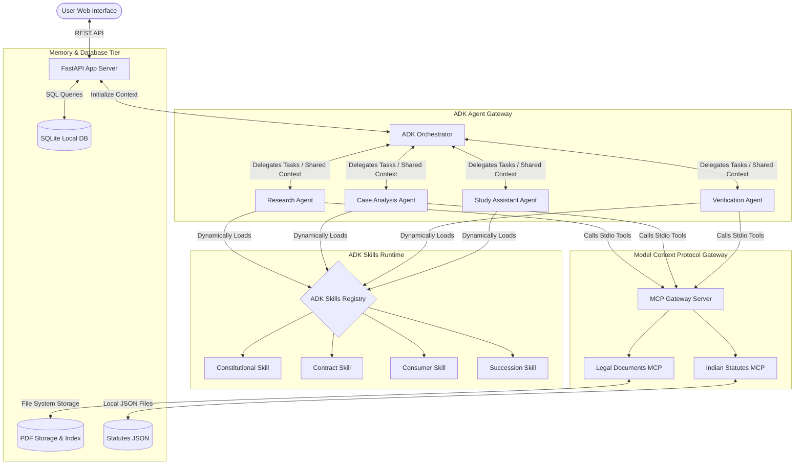
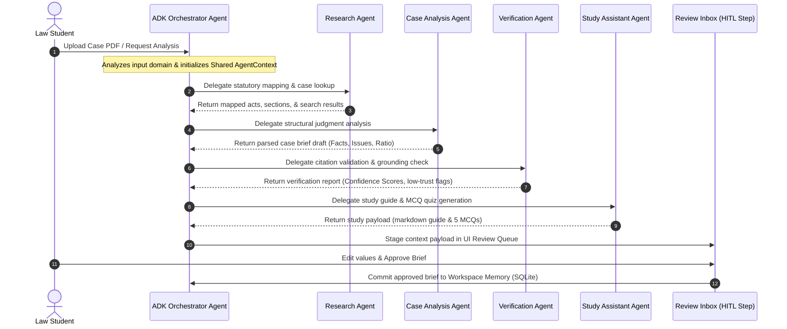
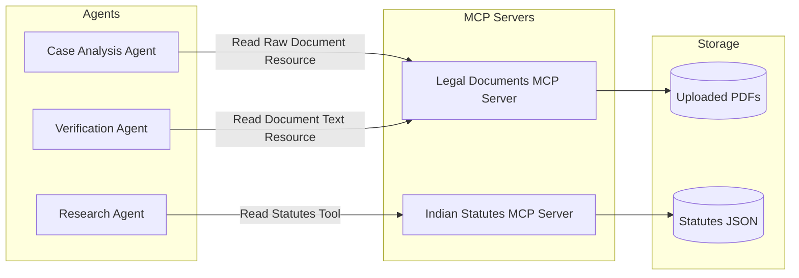
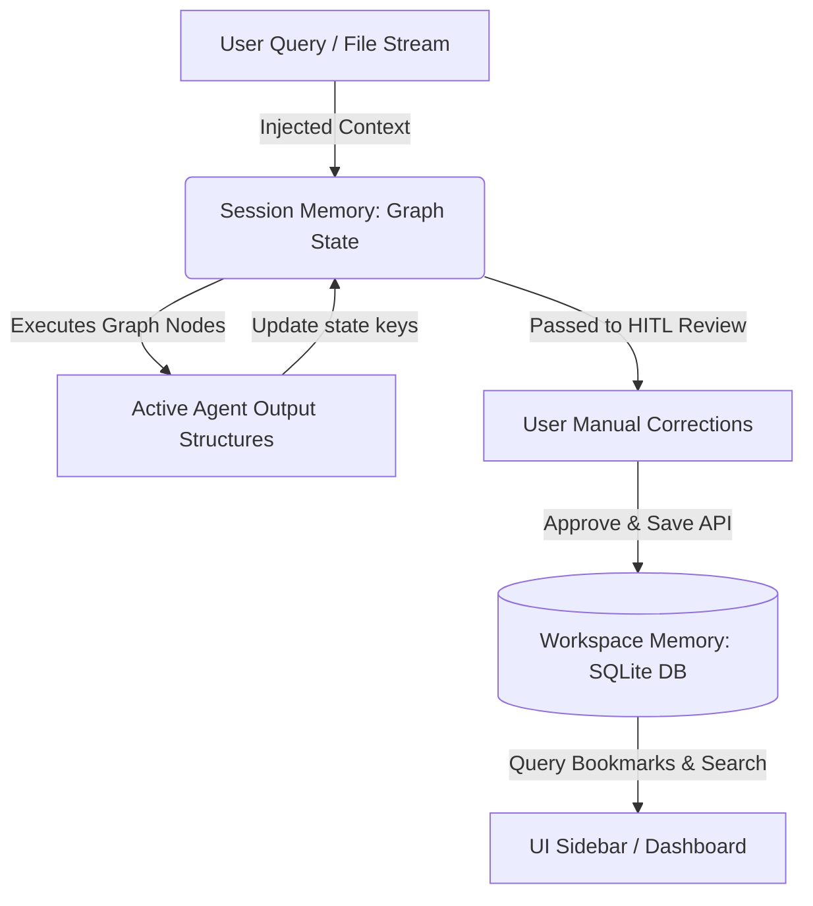

# LexAgent: ADK-First Implementation Architecture

---

## 1. Capstone Architecture Alignment
LexAgent is designed as a direct, concrete demonstration of the software patterns and agent systems design principles taught in the **Google + Kaggle AI Agents Intensive Course**. The architecture is built around the **Google Agent Development Kit (ADK)** standard, which structures agents as declarative reasoning entities with dynamically loaded skills, unified context windows, and standardized Tool/MCP connections.

* **Day 1: Agentic Engineering**: Instead of single-prompt scripting, tasks are broken down and handled by dedicated ADK Agents, utilizing structured JSON output schemas to enforce reliability.
* **Day 2: MCP & Agent Interoperability**: Implements the Model Context Protocol (MCP) over STDIO to decouple reasoning from statutory text databases and PDF storage. Agent interoperability is managed through standard ADK agent delegation and a shared `AgentContext` object.
* **Day 3: Skills & Progressive Disclosure**: Reusable domain knowledge is encapsulated into first-class **ADK Skills** (Contract, Constitution, Consumer, Succession) containing specific instructions and tools. These skills are loaded dynamically, protecting the LLM from context window rot.
* **Day 4: Security, Grounding & Human-in-the-Loop**: The `Verification Agent` checks facts against source texts before any notes are committed. The system halts progress at a Human-in-the-Loop (HITL) approval step to allow manual editing of summary drafts.
* **Day 5: Production Readiness**: Standardizes logging and observability traces across all agent handoffs, establishing a robust local-first SQLite and Next.js deployment.

---

## 2. High-Level ADK Architecture Diagrams

### 2.1 ADK High-Level Architecture Diagram
This diagram shows how ADK structures agents, skills, and tools into a clean, decoupled execution environment.


---

### 2.2 Agent Delegation & Collaboration Flow
Shows the sequence of delegation and data handoffs between ADK Agents.


---

### 2.3 MCP Interaction Diagram
This diagram shows how agents isolate domain-specific database reads using stdio-based MCP servers rather than accessing storage directly.


---

### 2.4 Memory Flow Diagram
Shows how information transitions from short-term runtime context to local database tables.


---

## 3. ADK Agent Definitions & Specifications

In the ADK framework, each agent is defined by its system instructions, registered skills, input context, and exit transitions.

### 3.1 Orchestrator Agent
* **Purpose**: Serves as the primary controller. It parses requests, initiates the shared `AgentContext`, coordinates delegation to specialized agents, and runs task routing rules.
* **Responsibilities**:
  * Analyze user intent to determine the legal domain.
  * Load appropriate domain-specific instructions and skills.
  * Delegate sub-tasks to Research, Case Analysis, Verification, and Study Assistant agents.
  * Coordinate error retries and capture final values for the HITL review step.
* **Inputs**: Raw student query or document upload request, initial system context.
* **Outputs**: Updated shared `AgentContext` and routing instructions to child agents.
* **Skills Used**: Orchestration Skill.
* **MCP Access**: None (delegates data access to specialized agents).
* **Memory Access**: Reads past chat folders and user profile targets from SQLite.
* **Failure Modes**: Routing recursion (infinite looping between agents), LLM response timeout.
* **Retry Strategy**: 
  * If a child agent fails to return structured data, the Orchestrator sends a repair query to that agent with the previous output and the target validation exception.
  * Limits retries to 3 per agent node. If unresolved, routes to the user with a warning banner.
* **Example Execution**: Reads user request to review a lease agreement case. Maps the request to "Contract Law", instantiates the `ContractLawSkill` for the workflow context, and delegates to the `Case Analysis Agent`.

---

### 3.2 Research Agent
* **Purpose**: Performs legal search, maps statutory rules, and retrieves matching precedents.
* **Responsibilities**:
  * Formulate precise search terms from raw user prompts.
  * Call statute retrieval tools to map issues to exact acts, chapters, and sections.
  * Query similarity indexes to find relevant landmark cases.
* **Inputs**: Query context, active legal domain indicator.
* **Outputs**: Mapped acts, section numbers, official text fragments, and landmark case names written to the `AgentContext`.
* **Skills Used**: Constitutional Law Skill, Contract Law Skill, Consumer Protection Skill, Succession Law Skill (loaded dynamically).
* **MCP Access**: Uses tools from the `Indian Statutes MCP Server`.
* **Memory Access**: Reads bookmarks and user-saved cases.
* **Failure Modes**: Empty search queries, incorrect statutory section mapping.
* **Retry Strategy**: 
  * If the primary query yields zero statutory matches, queries with relaxed semantic filters.
* **Example Execution**: Receives request: "Can a contract be cancelled if a government order makes it impossible to do?". Queries the `Indian Statutes MCP Server` and retrieves the text of Section 56 of the Indian Contract Act, 1872.

---

### 3.3 Case Analysis Agent
* **Purpose**: Parses legal judgments to extract structural briefs and core legal reasoning.
* **Responsibilities**:
  * Read raw judgment text and segment it into structured outputs.
  * Extract Petitioner and Respondent arguments.
  * Isolate the *Ratio Decidendi* (binding core reasoning) and *Obiter Dicta* (non-binding commentary).
  * Extract court citations, bench size, and dissenting opinions.
* **Inputs**: Uploaded document identifier, raw document text resource.
* **Outputs**: Case brief document matching the structured FIRAC schema rules.
* **Skills Used**: Case Reading Skill.
* **MCP Access**: Calls `Legal Documents MCP Server` resources.
* **Memory Access**: None.
* **Failure Modes**: Judgment size exceeds context window, missing ratio section in output.
* **Retry Strategy**: 
  * For documents exceeding 100 pages, queries document text chunks based on semantic legal keywords ("Held", "Ratio", "Dissent") and parses these segments to assemble the brief.
* **Example Execution**: Parses *Satyabrata Ghose v. Mugneeram Bangur*. Identifies Section 56 application, extracts the petitioner's argument, respondent's defense, and the Court's holding that temporary land requisition did not frustrate the contract.

---

### 3.4 Study Assistant Agent
* **Purpose**: Translates complex briefs and acts into simplified, high-fidelity study notes and exam practice questions.
* **Responsibilities**:
  * Summarize dense legal reasoning into revision notes.
  * Generate multiple-choice questions (MCQs) with detailed explanations (rationales) for correct and incorrect answers.
  * Output flashcards targeting landmark case holdings.
* **Inputs**: Case briefs and statutory references from `AgentContext`.
* **Outputs**: Array of MCQs, revision notes, and study cards.
* **Skills Used**: Educational Pedagogy Skill.
* **MCP Access**: None (operates on context payloads).
* **Memory Access**: None.
* **Failure Modes**: Generating simple or repetitive questions, options containing ambiguous correct answers.
* **Retry Strategy**: 
  * Evaluates generated questions against an internal rubric: "Does this quiz test exceptions? Is there exactly one correct answer?" If validation fails, regenerates the question.
* **Example Execution**: Reads *Maneka Gandhi* case brief. Generates 3 MCQs testing the difference between "procedure established by law" and "due process of law" under Article 21.

---

### 3.5 Verification Agent
* **Purpose**: Ensures trust, factual grounding, and accurate citations.
* **Responsibilities**:
  * Verify that every assertion in the brief is grounded in the raw text of the uploaded judgment PDF.
  * Parse and check case citations using regular expressions and a local landmark database.
  * Calculate a Trust Confidence Score (0-100%).
* **Inputs**: Generated briefs, raw source text chunks.
* **Outputs**: Verification report with grounding scores and warnings.
* **Skills Used**: Legal Verification Skill.
* **MCP Access**: Accesses `Legal Documents MCP Server` to match assertions against raw document text.
* **Memory Access**: None.
* **Failure Modes**: False positive grounding failures.
* **Retry Strategy**: 
  * If an assertion is initially marked as ungrounded, performs a localized similarity search on the source text chunks to verify if a matching sentence exists.
* **Example Execution**: Scans the generated summary of *Vineeta Sharma v. Rakesh Sharma*. Validates the citation `(2020) 9 SCC 1` and checks if the summary's claim regarding daughter's retroactive rights is supported by the raw judgment PDF.

---

## 4. ADK Skills Architecture (Day 3 Concepts)

In the ADK framework, **Skills** are first-class architectural components. A Skill encapsulates system prompts, domain knowledge, and specific tools. 

```
                                  [ ADK Skill Registry ]
                                             │
      ┌────────────────────────┬─────────────┴──────────┬────────────────────────┐
      ▼                        ▼                        ▼                        ▼
[Constitutional Law Skill] [Contract Law Skill] [Consumer Protection Skill] [Succession Law Skill]
- Prompt instructions      - Prompt instructions   - Prompt instructions      - Prompt instructions
- Landmark SC rulings      - ICA, 1872 provisions  - CPA, 2019 provisions     - HSA Coparcenary rules
- Bench lookup tool        - Elements checker tool - Jurisdiction calculator  - Wills validator tool
```

By decoupling domain expertise into distinct skills, the system implements **progressive disclosure**: prompts and tools are loaded only when the active workflow requires them, preventing context window bloat and eliminating model confusion.

### 4.1 Constitutional Law Skill
* **Trigger Conditions**: Prompt text contains "Article", "Constitution", "dissenting opinion", "amendment", "Writ", "basic structure", or refers to constitutional landmark cases (e.g., *Kesavananda*, *Maneka Gandhi*, *Puttaswamy*).
* **Loaded Context**: Text of Articles 14, 19, and 21. Landmark case metadata maps (bench size, authors, status).
* **Prompt Instructions**:
  > "Identify constitutional disputes under Part III. Ensure that you differentiate between the Court's majority holding and dissenting opinions. Check the bench size; larger benches establish binding precedent over smaller ones."
* **Available Tools**:
  * `fetch_bench_composition(case_id)`: Retrieves the number of judges and the opinion author.
* **Example Queries**: *"What is the significance of the basic structure doctrine in Kesavananda Bharati?"*

---

### 4.2 Contract Law Skill
* **Trigger Conditions**: Prompt text contains "agreement", "contract", "breach", "damages", "consideration", "indemnity", "guarantee", "bailment", "frustration", "Section 56", "Section 73".
* **Loaded Context**: Indian Contract Act, 1872 statutory text (Sections 10, 25, 56, 73, 74). Key case summaries (*Satyabrata Ghose*, *Hadley v Baxendale*).
* **Prompt Instructions**:
  > "Assess the validity of the contract (offer, acceptance, consideration). In breach scenarios, analyze if damages are liquidated (Sec 74) or unliquidated (Sec 73). For impossibility disputes, apply Section 56."
* **Available Tools**:
  * `verify_contractual_elements(facts)`: Evaluates offer, acceptance, and consideration.
* **Example Queries**: *"Analyze this fact scenario to check if the agreement is void under Section 56."*

---

### 4.3 Consumer Protection Skill
* **Trigger Conditions**: Prompt text contains "consumer commission", "deficiency of service", "pecuniary jurisdiction", "unfair trade", "product liability", "misleading advertisement".
* **Loaded Context**: Consumer Protection Act, 2019 text (Sections 2(9), 2(11), 34, 47, 58).
* **Prompt Instructions**:
  > "Verify that the buyer does not fall under the commercial use exclusion. Check that the claim amount maps to the correct Commission (District: <= 50L; State: <= 2C; National: > 2C) under the 2019 Act."
* **Available Tools**:
  * `verify_consumer_status(buyer_details)`: Filters out commercial transactions.
  * `calculate_commission_jurisdiction(claim_value)`: Returns District, State, or National Commission.
* **Example Queries**: *"Determine if a company purchasing laptops for employee use can file a consumer case."*

---

### 4.4 Succession Law Skill
* **Trigger Conditions**: Prompt text contains "will", "probate", "intestate", "heir", "succession certificate", "coparcenary", "partition", "Section 6", "Hindu Succession Act", "Indian Succession Act".
* **Loaded Context**: Hindu Succession Act, 1956 (specifically the 2005 Amendment text of Section 6) and Indian Succession Act, 1925 will execution rules.
* **Prompt Instructions**:
  > "Apply the rules of joint family property devolution. Ensure that daughters are treated as equal coparceners as established by Section 6 (2005 Amendment) and the ruling in Vineeta Sharma."
* **Available Tools**:
  * `validate_will_execution(will_metadata)`: Evaluates attestation rules (number of witnesses, signing intent).
* **Example Queries**: *"Does a daughter have partition rights if the ancestral property was partitioned in 2002?"*

---

## 5. MCP (Model Context Protocol) Architecture (Day 2 Concepts)

LexAgent isolates external data access layers from the agents by executing exactly **two local stdio-based MCP servers**.

```
  ┌────────────────────────────────────────────────────────┐
  │                   LEXAGENT RUNTIME                     │
  │     Orchestrator  ──> Delegates Tasks to Agents         │
  └───────────────────────────┬────────────────────────────┘
                              │ Standard JSON-RPC over STDIO
                              ▼
  ┌────────────────────────────────────────────────────────┐
  │                      MCP GATEWAY                       │
  │  ┌───────────────────────┐   ┌──────────────────────┐  │
  │  │ Legal Documents Server│   │ Indian Statutes Serv │  │
  │  └──────────┬────────────┘   └──────────┬───────────┘  │
  └─────────────┼───────────────────────────┼──────────────┘
                ▼                           ▼
        [Uploaded Case PDFs]       [Acts & Section JSONs]
```

### 5.1 Legal Documents MCP Server
Exposes resources and tools for retrieving and parsing uploaded judgment PDFs.
* **Resources**:
  * `lexagent://documents/list`: Returns a listing of active workspace PDFs.
  * `lexagent://documents/{doc_id}/raw`: Exposes the raw text of a judgment.
* **Tools**:
  * `parse_pdf_document(file_path)`: Extract text from local PDF files.
  * `search_document_chunks(doc_id, query)`: Return relevant matching text blocks from the document based on a search string.
* **Accessed By**: *Case Analysis Agent* and *Verification Agent*.
* **Example Request**:
```json
{
  "jsonrpc": "2.0",
  "method": "tools/call",
  "params": {
    "name": "search_document_chunks",
    "arguments": {
      "doc_id": "hadley_v_baxendale",
      "query": "damages naturally arising"
    }
  },
  "id": 1
}
```
* **Example Response**:
```json
{
  "jsonrpc": "2.0",
  "result": {
    "content": [
      {
        "type": "text",
        "text": "Where two parties have made a contract which one of them has broken, the damages which the other party ought to receive..."
      }
    ]
  },
  "id": 1
}
```

---

### 5.2 Indian Statutes MCP Server
Provides statutory provisions, acts, and amendments from a local JSON database.
* **Resources**:
  * `statutes://acts/list`: Complete listing of available Indian Acts.
  * `statutes://{act_name}/section/{section_number}`: Exposes the statutory text of a section.
* **Tools**:
  * `get_section_text(act_name, section_number)`: Returns statutory text of the section.
  * `search_statutes(query)`: Semantic keyword search across acts to return section matches.
* **Accessed By**: *Research Agent* and *Verification Agent*.
* **Example Request**:
```json
{
  "jsonrpc": "2.0",
  "method": "tools/call",
  "params": {
    "name": "get_section_text",
    "arguments": {
      "act_name": "contract-act",
      "section_number": "56"
    }
  },
  "id": 2
}
```
* **Example Response**:
```json
{
  "jsonrpc": "2.0",
  "result": {
    "content": [
      {
        "type": "text",
        "text": "Section 56: Agreement to do impossible act. An agreement to do an act impossible in itself is void..."
      }
    ]
  },
  "id": 2
}
```

---

## 6. Memory & Shared Context Architecture (Day 3 Concepts)

### 6.1 Session Memory (Short-Term Runtime State)
* **Shared AgentContext Object**: A single, unified state payload passed between ADK Agents:

```json
{
  "session_id": "sess_98234",
  "user_query": "Explain how Section 56 of the Contract Act applies to lease agreements.",
  "active_domain": "contract_law",
  "uploaded_file": {
    "doc_id": "raja_dhruv_dev_1968",
    "filename": "raja_dhruv_dev_chand.pdf",
    "status": "PROCESSED"
  },
  "statutory_references": [
    {
      "act": "Indian Contract Act, 1872",
      "section": "56",
      "text": "An agreement to do an act impossible in itself is void..."
    }
  ],
  "retrieved_cases": [
    {
      "case_name": "Raja Dhruv Dev Chand v. Raja Harmohinder Singh",
      "citation": "AIR 1968 SC 1024"
    }
  ],
  "case_briefs": [
    {
      "doc_id": "raja_dhruv_dev_1968",
      "facts": "A lease of agricultural land was entered into before partition...",
      "issues": "Does partition and loss of possession frustrate a lease agreement?",
      "rule": "Section 56, Indian Contract Act, 1872",
      "analysis": "The Supreme Court held that Section 56 does not apply to completed leases...",
      "conclusion": "The lease was not frustrated."
    }
  ],
  "verification_report": {
    "grounding_score": 95.0,
    "citation_score": 100.0,
    "confidence_score": 97.0,
    "warnings": []
  },
  "study_materials": {
    "revision_notes": "# Section 56 and Lease Agreements...",
    "quizzes": [
      {
        "question": "Does frustration apply to completed leases of agricultural land?",
        "options": ["Yes", "No", "Only if registered", "None of the above"],
        "correct_option_index": 1,
        "explanation": "Section 56 does not apply to completed leases (Raja Dhruv Dev Chand)."
      }
    ]
  },
  "agent_errors": []
}
```

* **Retrieval & Injection**: Passed directly to agents during execution. ADK uses `AgentContext` filters to expose only necessary elements to individual agents, protecting context space.

### 6.2 Workspace Memory (Long-Term Local Database)
* **Data Stored**: User profile, target exams (e.g., Delhi Judicial Services), bookmarked cases, and completed quiz scores saved in local SQLite tables.
* **Retrieval Strategy**: Fetched via FastAPI REST endpoints during dashboard render.

---

## 7. Security, Grounding & HITL Architecture (Day 4 Concepts)

```
 [User Uploads PDF] ──> [Agents Run] ──> [Verification Check] ──> [Review Inbox (UI)]
                                                                       │
 [Workspace SQLite] <── [Save] <── [User Approves] <── [User Edits Draft Summary]
```

### 7.1 Grounding Verification
* **Responsible Agent**: `Verification Agent`.
* **Mechanism**: Compares the generated brief's claims against the raw source text chunks retrieved from the `Legal Documents MCP Server`. If an assertion lacks factual grounding, it is flagged as `[UNGROUNDED]`.

### 7.2 Citation Verification
* **Responsible Agent**: `Verification Agent`.
* **Mechanism**: Uses regular expressions to identify standard citation patterns. Cross-references matches with a local lookup database containing 50 landmark Supreme Court cases to determine if they are overruled or modified.

### 7.3 Confidence Scoring
* **Scoring Algorithm**:
$$Confidence\ Score = (Grounding\ Rate \times 0.6) + (Valid\ Citation\ Rate \times 0.4)$$
* Briefs scoring under 80% are flagged in the UI.

### 7.4 Human-in-the-Loop (HITL) Workflow
1. **Staged Cache**: The generated brief is written to a temporary cache table, not the permanent database.
2. **Review Inbox**: The brief is loaded in the client UI. Low-confidence statements are highlighted in yellow.
3. **Manual Editing**: The student edits the text fields directly in the UI to correct inaccuracies or add context.
4. **Permanent Save**: Upon clicking "Approve and Save", the updated, corrected brief is committed to the long-term SQLite workspace database.

---

## 8. User Journeys (Logical Flows)

### 8.1 Scenario 1: User uploads a Supreme Court judgment PDF
* **Step 1**: Student drops PDF in Case Analyzer UI -> Backend registers file `hadley_baxendale.pdf`.
* **Step 2**: `Orchestrator Agent` triggers `Case Analysis Agent`. 
* **Step 3**: `Case Analysis Agent` calls `Legal Documents MCP Server` to extract raw text and segment content.
* **Step 4**: `Case Analysis Agent` parses the segmented text, compiling the initial FIRAC brief JSON.
* **Step 5**: `Orchestrator Agent` invokes the `Verification Agent`.
* **Step 6**: `Verification Agent` reads the brief, runs regex searches, cross-references citations, and scores grounding.
* **Step 7**: Draft brief is staged in the UI Review Inbox for student manual edit and final SQLite saving.

---

### 8.2 Scenario 2: User asks: "Explain Section 73 of the Indian Contract Act."
* **Step 1**: Student types query in Research Console.
* **Step 2**: `Orchestrator Agent` identifies "Contract Law" domain, loads Contract Law Skill context, and forwards query to `Research Agent`.
* **Step 3**: `Research Agent` queries `Indian Statutes MCP Server` with parameters `{"act_name": "contract-act", "section_number": "73"}`.
* **Step 4**: MCP server returns the full text of Section 73.
* **Step 5**: `Research Agent` searches the vector database for landmark cases (retrieving *Hadley v Baxendale*).
* **Step 6**: `Orchestrator Agent` routes results to the user UI, displaying the explanation, case context, and statutory sections cleanly.

---

### 8.3 Scenario 3: User wants: "Generate exam notes and quiz questions from this case."
* **Step 1**: Student views an approved case brief and clicks "Generate Study Material".
* **Step 2**: `Orchestrator Agent` retrieves the case brief from SQLite and routes it to the `Study Assistant Agent`.
* **Step 3**: `Study Assistant Agent` uses the Educational Pedagogy Skill to write a structured revision summary.
* **Step 4**: `Study Assistant Agent` generates 5 quiz questions containing clear rationales.
* **Step 5**: The output is written to session state and rendered in the UI Study Zone. The student takes the test and saves results to Workspace Memory.

---

## 9. Recommended Build Order

To complete the project before the **July 4 deadline**, follow this sequential implementation order:

```
[Phase 1: ADK Orchestrator] -> [Phase 2: Local MCP] -> [Phase 3: ADK Skills] -> [Phase 4: Verification Agent] -> [Phase 5: UI & Observability]
```

* **Phase 1: ADK Orchestrator & State Setup (Days 1–3)**: Setup FastAPI, declare the ADK runtime environment, and establish the local SQLite memory tables.
* **Phase 2: Local MCP Servers (Days 4–5)**: Implement the stdio JSON-RPC `Indian Statutes` and `Legal Documents` MCP Servers.
* **Phase 3: ADK Skills Integration (Days 6–7)**: Write the 4 lightweight skill modules (Contract, Constitutional, Consumer, Succession) and configure dynamic loading.
* **Phase 4: Verification Agent & Grounding (Days 8–9)**: Build the citation regex engine, factual grounding prompter, and quiz generator.
* **Phase 5: Next.js Frontend & Observability (Days 10–12)**: Construct the UI dashboard, hook up the Review Inbox, establish trace logging visual outputs, and complete final testing.
