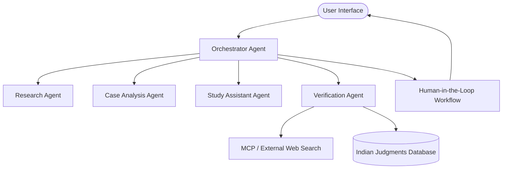

# LexAgent: Product Requirements Document (PRD)
## AI-Powered Multi-Agent Legal Research, Case Analysis, and Study Assistant Platform for Indian Law Students

---

## 1. Executive Summary

### 1.1 Project Overview
LexAgent is an advanced, domain-specific, multi-agent AI platform designed to transform how Indian law students, judiciary exam aspirants, and legal researchers conduct research, analyze judgments, and prepare for academic examinations. LexAgent is built for the **Google + Kaggle "5-Day AI Agents: Intensive Vibe Coding" Capstone Project**. 

The platform leverages state-of-the-art agentic workflows, Model Context Protocol (MCP) integrations, human-in-the-loop (HITL) workflows, and rigorous citation verification engines to deliver highly structured, reliable, and context-aware assistance specifically tailored to the Indian legal system.

### 1.2 Purpose of this Document
This Product Requirements Document (PRD) defines the complete functional scope, technical architecture, agent topology, user experience, trust mechanisms, and evaluation framework for LexAgent. It serves as the single source of truth for engineering teams, Kaggle judges, and technical mentors to evaluate the design, production readiness, and impact of the platform.

---

## 2. Problem Statement

### 2.1 The Indian Legal Education Crisis
Indian law students face a unique set of challenges that traditional general-purpose AI systems cannot address:
* **Overwhelming Volume & Length of Judgments**: Supreme Court and High Court judgments in India frequently span dozens to hundreds of pages (e.g., *Kesavananda Bharati* is over 700 pages). Reading, understanding, and extracting the legal ratio takes hours of manual effort.
* **Complex Multi-Tier System**: Indian law is an intricate web of central statutes, state amendments, administrative regulations, and case law precedents. General AI models struggle to contextualize which law applies where.
* **Lack of Structure**: High court judgments do not follow a standardized structure, making it hard to identify arguments, petitioner/respondent positions, obiter dicta, and ratio decidendi.
* **Exam Preparation Hurdles**: Preparing for university exams and the highly competitive Judicial Services Examinations requires structured FIRAC (Facts, Issues, Rules, Analysis, Conclusion) briefs, flashcards of landmark cases, and practice quizzes, which students must compile manually.

### 2.2 Shortcomings of Existing AI Tools
* **Generic Legal Context**: Most tools are optimized for US/UK jurisdictions and fail on Indian Penal/Civil codes, Constitutional articles, or regional High Court rules.
* **High Hallucination Rates**: LLMs routinely fabricate citations, court cases, and statutory sections (e.g., claiming a section exists under the Indian Contract Act when it does not).
* **No Verification**: Standard chatbots provide legal summaries without pinpoint citations or link checks, exposing students to dangerous academic and professional inaccuracies.
* **Lack of Memory**: Tools treat each prompt as isolated, failing to understand the user's ongoing research project, syllabus focus, or learning pace.

---

## 3. Vision Statement

To democratize legal education in India by providing every student with an elite, multi-agent legal co-pilot that is:
1. **Unquestionably Accurate**: Rooted in verifiable, cited Indian legal sources.
2. **Pedagogically Structured**: Tailored to help students learn legal reasoning, not just copy answers.
3. **Agentically Collaborative**: Automating complex research pipelines via specialized agents cooperating seamlessly under human supervision.

---

## 4. User Personas

### 4.1 Persona 1: Rohan Sharma — The First-Year Law Student
* **Background**: 1st Year, 5-year B.A. LL.B. (Hons.) at NLSUI, Bangalore.
* **Core Goal**: Understand basic legal doctrines, survive massive reading assignments, and learn how to draft FIRAC case briefs.
* **Pain Points**: Struggles with archaic legal English; spends 6+ hours reading a single Contract Law judgment; doesn't know how to separate the Court’s core decision (Ratio) from passing remarks (Obiter).
* **LexAgent Value**: Instant vocabulary assistance, guided FIRAC briefs, and interactive walk-throughs of contract cases.

### 4.2 Persona 2: Priya Patel — The Final-Year Law Student
* **Background**: 5th Year, LL.B. student at ILS Law College, Pune.
* **Core Goal**: Research and write a high-scoring dissertation on "The Evolution of Right to Privacy under Article 21" and apply for corporate litigation internships.
* **Pain Points**: Needs to cite at least 40 landmark and recent Supreme Court judgments; spends days manually verifying if citations match official AIR or SCC reports; worries about missing a recent 2026 judgment that overrules her main argument.
* **LexAgent Value**: Multi-agent research lookup, citation verification engine, and instant alerts on overruled or distinguished precedents.

### 4.3 Persona 3: Vikram Aditya — The Judiciary Aspirant
* **Background**: Law Graduate, full-time preparing for the Delhi Judicial Services (DJS) Examination.
* **Core Goal**: Memorize hundreds of statutory sections, landmark judgments, and key amendments under Constitutional, Contract, and Succession Law.
* **Pain Points**: Standard textbooks are dry and lack practice questions; needs to test active recall under pressure; struggles to create structured revision summaries of large Acts.
* **LexAgent Value**: Automated generation of interactive quizzes (Judiciary level), conceptual flashcards with spaced-repetition prompts, and summary guides of complex amendments.

### 4.4 Persona 4: Dr. Anjali Mehta — The Legal Researcher & Professor
* **Background**: Senior Legal Academic and Professor at NLU, Delhi.
* **Core Goal**: Conduct cross-disciplinary research on consumer protection in the digital age.
* **Pain Points**: Generalist AI tools produce low-quality summaries that miss subtle legal nuances; requires tracing legislative history (e.g., amendments to the Consumer Protection Act, 2019 vs 1986).
* **LexAgent Value**: Multi-agent deep research workspace, collaborative review of drafts, high-precision source mapping, and exportable academic-grade briefs.

---

## 5. User Stories

### 5.1 Legal Research
1. **As a** final-year law student, **I want** to search for cases related to "anticipatory bail under succession law disputes," **so that** I can find relevant court precedents for my moot court brief.
2. **As a** first-year law student, **I want** to query legal concepts in plain language (e.g., "what is promissory estoppel"), **so that** I can understand the doctrine without getting bogged down in complex jargon.
3. **As a** legal researcher, **I want** to filter search results by specific Indian High Courts and date ranges, **so that** I can focus only on binding regional precedents.
4. **As a** judiciary aspirant, **I want** a chronological timeline of judgments related to the "Basic Structure Doctrine," **so that** I can trace the evolution of Constitutional amendments.
5. **As a** law student, **I want** the system to automatically map matching sections of the Indian Contract Act to my factual scenario, **so that** I know which statutory provision applies.

### 5.2 Case Analysis & Briefing
6. **As a** first-year law student, **I want** to upload a 50-page judgment PDF, **so that** I can get a structured FIRAC brief in under 30 seconds.
7. **As a** legal researcher, **I want** to see a side-by-side comparison of the petitioner's and respondent's arguments in a landmark constitutional case, **so that** I can analyze the litigation strategy.
8. **As a** final-year law student, **I want** the case analyzer to explicitly highlight the *ratio decidendi* of a judgment, **so that** I don't confuse it with *obiter dicta*.
9. **As a** law student, **I want** to see the bench composition (e.g., 3-judge bench vs 5-judge bench) and any dissenting opinions in a judgment, **so that** I can understand the weight and internal conflict of the precedent.
10. **As a** professor, **I want** to export case briefs in Markdown or PDF format, **so that** I can share them as reading material for my students.

### 5.3 Citation & Trust
11. **As a** final-year law student, **I want** the system to cross-reference every cited case in a generated note with official databases (like AIR, SCC, or Indian Kanoon), **so that** I do not submit invalid citations.
12. **As a** legal researcher, **I want** to see a trust confidence score (0-100%) for every summary generated by the AI, **so that** I know how much verification is required.
13. **As a** judiciary aspirant, **I want** the system to alert me if a judgment I am studying has been overruled or modified by a subsequent Supreme Court bench, **so that** I do not memorize outdated law.
14. **As a** law student, **I want** the AI to highlight text that contains assumptions or low-confidence conclusions, **so that** I can manually review those specific parts.

### 5.4 Study Assistant & Exam Prep
15. **As a** judiciary aspirant, **I want** to generate a deck of 20 interactive flashcards from a Constitutional Law summary, **so that** I can test my recall of Article numbers.
16. **As a** final-year law student, **I want** to take a generated MCQ quiz on Consumer Protection Law, **so that** I can gauge my preparedness for the upcoming semester exam.
17. **As a** law student, **I want** each quiz question explanation to explain *why* the correct option is right and *why* other options are wrong, **so that** I can learn from my mistakes.
18. **As a** judiciary aspirant, **I want** my flashcards to integrate with a spaced repetition system (SRS) scheduler, **so that** I review difficult cards more frequently.

### 5.5 Workspace, Memory & Collaboration
19. **As a** final-year law student, **I want** the workspace memory to remember my research topic ("Section 12 of Hindu Succession Act") across chat sessions, **so that** I don't have to re-upload files or re-explain context.
20. **As a** law student, **I want** to review, edit, and approve the AI-generated FIRAC brief before it is saved to my permanent workspace, **so that** I retain full control over the final notes.

---

## 6. Functional Requirements



### 6.1 Legal Research Assistant
* **Query Understanding**: Parse natural language queries containing legal jargon, abbreviations (e.g., "Art. 21", "Sec. 138 NI Act"), and misspelt terminology, converting them into structured search inputs.
* **Domain Filtering**: Limit queries to the four core domains for the MVP:
  1. *Constitutional Law*
  2. *Consumer Protection Law*
  3. *Succession Law*
  4. *Contract Law*
* **Statute Mapping**: Automatically map a factual scenario to relevant acts, chapters, and sections.
* **Precedent Retrieval**: Retrieve landmark and recent judgments matching the user's research focus using vector similarity search integrated with legal databases.

### 6.2 Case Analysis Assistant
* **Judgment Ingestion**: Support file uploads (PDF, DOCX, TXT) up to 50MB. Parse OCR and clean headers/footers of legal documents.
* **Structural Parsing**: Segment judgments into:
  * Bench Composition (Judges' names, division size)
  * Petitioner & Respondent details
  * Prior Proceedings (Trial court / High Court history)
  * Facts of the Case
  * Substantive Issues Framed
  * Arguments of Petitioner
  * Arguments of Respondent
  * Ratio Decidendi (Core legal reasoning & holding)
  * Obiter Dicta (Non-binding judicial observations)
  * Final Order/Disposition

### 6.3 FIRAC Case Brief Generator
* **Automated FIRAC Construction**: Re-synthesize parsed judgments into a standard 5-part FIRAC template:
  * **Facts (F)**: Concise factual narrative.
  * **Issue (I)**: Legal questions the Court had to answer.
  * **Rule (R)**: Applicable statutes, articles, and prior case law precedents.
  * **Analysis (A)**: Detail of how the court applied the Rule to the Facts.
  * **Conclusion (C)**: The final ruling and impact.
* **Template Customization**: Allow students to toggle brief detail levels: "Quick Revision" (1 page) vs "Deep Analysis" (3-5 pages).

### 6.4 Citation Verification
* **Citation Extraction**: Extract all citations (e.g., *AIR 2018 SC 4321*, *(2020) 3 SCC 1*) from uploaded documents or generated notes.
* **Validity Testing**: Validate citations against official Supreme Court of India or High Court registries.
* **Precedent Status Check**: Flag if a cited judgment has been:
  * *Overruled* (no longer good law)
  * *Distinguished* (applicable only to specific facts)
  * *Reversed* on appeal
  * *Upheld/Followed* in recent judgments

### 6.5 Study Note Generation
* **Syllabus-Aligned Summarizer**: Group notes under university legal syllabus topics (e.g., "Doctrine of Frustration under Sec. 56 Contract Act").
* **Key Concept Explanations**: Provide simplified explanations, illustrations, and real-world scenarios representing complex legal concepts.
* **Chronological Tables**: Generate comparative timelines of case laws to explain statutory shifts.

### 6.6 Flashcard Generation
* **QA Card Creation**: Generate Question-Answer cards automatically from FIRAC briefs or search summaries.
* **Type Variety**: Create card formats including Cloze Deletions (fill-in-the-blanks), Case-to-Ratio matches, and Definition drills.
* **SRS Integration Ready**: Format flashcard data payloads (CSV/JSON) compatible with Anki and include metadata tags for domain categorization.

### 6.7 Quiz Generation
* **MCQ Engine**: Generate high-fidelity multiple-choice questions testing statutory sections, landmark case ratios, and factual applications.
* **Difficulty Modes**: Set difficulty levels:
  * *Academic*: Focuses on conceptual theory and university curriculum.
  * *Judiciary*: Focuses on precise statutory sections, exceptions, and subtle case details (similar to DJS, PCS, or UP PCS J).
* **Explanation Explanations**: Generate detailed rationales for correct answers and explanations as to why distractors are incorrect.

### 6.8 Human-in-the-Loop (HITL) Workflow
* **Staged Approvals**: Do not write agent outputs directly to the long-term knowledge base. Serve them first to the user in a "Draft Stage".
* **Interactive Editing**: Allow the user to edit, append, or delete portions of generated briefs and notes directly in the UI.
* **Feedback Loop**: Provide UI mechanisms (like inline flag buttons) for users to report hallucinations or citation errors, which update the agent's prompt context during retries.

### 6.9 Workspace Memory
* **Context Preservation**: Save session threads and active folders corresponding to research topics (e.g., "Dissertation on Hindu Succession Act Section 6").
* **Memory Dashboard**: Display a sidebar containing bookmarks, recent judgments analyzed, generated cards, and active review tasks.
* **Searchable Knowledge Store**: Provide full-text and semantic search over the user's previously generated and reviewed documents.

### 6.10 Multi-Agent Coordination
* **Dynamic Planning**: The Orchestrator agent evaluates user input, constructs an execution plan, and calls specialized sub-agents sequentially or in parallel.
* **Context Assembly**: Consolidate outputs from Research, Case Analysis, and Verification agents into a single, cohesive, well-formatted document.

---

## 7. Non-Functional Requirements

### 7.1 Reliability
* **Consistency**: Ensure structured JSON formatting for all agent-to-agent exchanges and agent-to-frontend payloads.
* **Deterministic Fallbacks**: If citation databases are offline, the Verification Agent must gracefully degrade, appending a warning tag: `[WARNING: Offline Citation Validation]` rather than hallucinating validation status.

### 7.2 Scalability
* **High-Throughput Parsing**: Process PDFs containing up to 150 pages without timeout crashes using asynchronous server tasks.
* **Parallel Execution**: Allow multiple agents (e.g., Research and Verification) to execute tasks concurrently, reducing wait time for users.

### 7.3 Security
* **Data Privacy**: Encrypt user-uploaded judgment documents in transit (HTTPS/TLS) and at rest (AES-256).
* **Workspace Isolation**: Restrict workspace retrieval so that users can never access or query other students' workspaces or uploaded documents.

### 7.4 Explainability & Transparency
* **Confidence Scoring**: Include a transparent "Confidence Score" for each section of a generated document.
* **Agent Trace Logs**: Offer a toggleable "Agent Trace View" showing the student exactly how the Orchestrator, Research, and Verification agents collaborated to produce the answer.
* **Pinpoint Referencing**: Every assertion made by the AI must map to an inline highlight or page reference in the uploaded source document or verified statutory act.

### 7.5 Performance
* **Response Latency**:
  * Simple research questions: under 3 seconds (using streaming).
  * FIRAC brief generation for a 20-page document: under 12 seconds.
* **UI Responsiveness**: Provide animated loading states, micro-interactions, and visual progress indicators showing the current sub-agent performing its task.

### 7.6 Maintainability
* **Modular Agent Framework**: Ensure addition of new agents (e.g., "Criminal Law Specialist Agent") requires only configuring a new agent node and registering its system prompts.
* **Standardized Interfaces**: Use clear JSON schemas for inputs and outputs across all agents to simplify troubleshooting and testing.

---

## 8. Information Architecture

### 8.1 Sitemap & Navigation

```
[ LexAgent Portal ]
  ├── Dashboard (Overview, active files, memory bookmarks)
  ├── Research Console (Natural language search, legal map, documents lookup)
  ├── Case Analyzer (Document dropzone, interactive FIRAC viewer, citation tracker)
  ├── Study Zone
  │     ├── Revision Notes (Topic summaries, timeline builder)
  │     ├── Flashcard Deck (SRS cards viewer, study session)
  │     └── Practice Tests (Quiz generator, results explanation panel)
  ├── Review Inbox (HITL review drafts, flagged issues list)
  └── Settings (User profile, target exam focus, API credentials)
```

### 8.2 Primary User Flows
1. **Case Ingestion & Briefing**:
   * User drops a PDF into the Case Analyzer -> Orchestrator initializes -> Analysis Agent extracts content -> Verification Agent checks citations -> Draft Brief displays in Review Inbox -> User edits and approves -> Brief saved to Workspace Memory.
2. **Exam Preparation**:
   * User selects "Study Zone" -> Requests quiz on "Article 19 - Freedom of Speech" -> Orchestrator triggers Study Agent -> Generates DJS-level quiz -> User answers questions -> UI displays step-by-step correct/incorrect explanations -> User saves difficult questions as Flashcards.

---

## 9. Agent Workflow Design

### 9.1 Agent Roles and Responsibilities

| Agent Name | Primary Responsibility | Input Payload | Output Payload | Tool & MCP Capabilities |
| :--- | :--- | :--- | :--- | :--- |
| **Orchestrator Agent** | Task planning, sub-agent routing, message coordination. | Raw User Query / File | Structured workflow plan, consolidated final JSON | LLM Router, state manager |
| **Research Agent** | Query analysis, statutory lookup, case matching. | Query, active legal domain | Matched acts, sections, landmark precedents | Vector database tool, search MCP |
| **Case Analysis Agent** | Deep document parsing, legal reasoning extraction. | Judgment PDF/Text stream | Structured FIRAC elements, argument maps | PDF Parser, section extractor |
| **Study Assistant Agent** | Study materials creation (cards, quizzes, notes). | Briefs, text documents | JSON array of MCQs, Flashcards, Summaries | Educational formatter, SRS tagger |
| **Verification Agent** | Source validity check, hallucination mitigation. | Citations list, assertions | Citation validation report, trust score | Indian Kanoon MCP, official registries |
| **Human Review Agent** | State management, UI correction handling. | User-edited draft briefs | Updated approved brief, user corrections | UI state interface, review dashboard |

### 9.2 Interaction Protocol & Failure Handling
* **Collaboration State Machine**: Agents communicate using a unified, shared state dictionary (graph state). As the workflow executes, each agent appends its findings to the shared state.
* **Failure Actions**:
  * *Verification Failure*: If a citation fails verification, the Verification Agent flags the citation, prompts the Research Agent to search for alternative citations, or attaches an warning alert to the final output.
  * *JSON Formatting Failure*: If a sub-agent outputs invalid JSON, the Orchestrator catches the error, passes the malformed output and the parsing exception back to the sub-agent, and requests a corrected payload (maximum 2 retries).

---

## 10. Memory Design

### 10.1 Structured Memory Architecture

```
                       [Memory Controller]
                                │
         ┌─────────────────────┼─────────────────────┐
         ▼                     ▼                     ▼
[Short-Term Memory]   [Long-Term Memory]     [Semantic Memory]
- Active Session State - User Profile & Goal  - Vectorized Files
- Current Search Context- Bookmarks & Notes   - RAG Documents
```

* **Short-Term Memory (Session Context)**: Tracks active conversation history, recent questions, and current workspace tasks.
* **Long-Term Memory (User Database)**: Stores persistent student properties, university/exam targets (e.g., Delhi Judicial Services preparation), and user bookmarked cases.
* **Semantic Memory (Workspace Vector Store)**: Houses vectorized chunks of user-uploaded judgments and generated notes, enabling semantic search and context injection during research chats.

### 10.2 State Retrieval & Context Injection
When a user launches a research task:
1. The Memory Controller checks the database for active topics.
2. Relevant past briefs, saved flashcards, and student profile preferences are fetched.
3. High-priority context is injected into the Orchestrator's prompt, ensuring continuity across sessions.

---

## 11. Security and Trust Design

### 11.1 The Citation Verification Pipeline
1. **Extraction**: The Verification Agent parses text for standard Indian citation patterns: `(Year) Vol SCC Page`, `AIR Year SC Page`, `SCC Online SC Page`.
2. **Lookup**: An MCP server queries official court registries or curated databases using the extracted citation keys.
3. **Cross-Reference check**: Ensure that the parties' names (e.g., *State of Maharashtra v. Madhukar Narayan*) match the cited index.
4. **Output Tagging**: Color-code citations in the UI:
   * <span style="color:green;font-weight:bold;">Green [Verified]</span>: Valid citation, matches metadata, judgment is active.
   * <span style="color:orange;font-weight:bold;">Yellow [Unverified]</span>: Registry could not find exact case index; check manually.
   * <span style="color:red;font-weight:bold;">Red [Overruled]</span>: Citation found but precedent has been overruled by a larger bench.

### 11.2 Hallucination Mitigation Strategy
* **Strict Source Grounding**: Sub-agents are restricted to synthesizing information present *only* in the retrieved context or verified statutory books.
* **Chain-of-Custody Logging**: Every sentence in the final summary includes a provenance ID linking back to the raw source segment.
* **Self-Contradiction Check**: The Verification Agent cross-examines the Research Agent's summary against statutory text to ensure exceptions or provisions are not misrepresented.

### 11.3 Trust and Confidence Scoring
Every generated document is assigned a **Trust Confidence Score (TCS)** calculated as:
$$TCS = 0.5 \times (V_c / T_c) + 0.3 \times S_c + 0.2 \times F_c$$
* Where:
  * $V_c / T_c$: Ratio of verified citations to total citations.
  * $S_c$: Source grounding ratio (percentage of sentences directly traceable to source document).
  * $F_c$: Fact verification score (absence of contradictory rules identified by Verification Agent).

---

## 12. Evaluation Framework

### 12.1 Success Metrics

| Metric | Target Goal | Measurement Method |
| :--- | :--- | :--- |
| **Accuracy Score** | > 95% | Evaluated using ground truth datasets of 50 Indian judgments. |
| **Citation Validity Rate** | 100% | Automated verification script testing all links and citations. |
| **Brief Generation Latency**| < 15 seconds | Server timestamp monitoring for standard 30-page inputs. |
| **Student Task Completion**| < 5 minutes | Time taken to generate notes, verify, and export briefs. |
| **User CSAT Score** | > 4.5 / 5.0 | Post-session UI rating and feedback surveys. |

### 12.2 Quality Evaluation Strategy (RAG Triad)
* **Context Relevance**: Verify that the Research Agent retrieves documents that match the user's statutory query.
* **Groundedness**: Ensure the Case Analyzer does not invent arguments, petitioner names, or holdings.
* **Answer Relevance**: Check that the output provides actionable answers to the student's legal query without fluff.

---

## 13. Technical Architecture

### 13.1 System Architecture

```
[ Frontend: React / Next.js / Vanilla CSS (Rich Theme) ]
                     │ (HTTPS / WebSockets)
                     ▼
[ Backend: Python FastAPI / LangGraph Orchestrator ]
  ├── SQLite (User Profile, Session Memory, App State)
  ├── ChromaDB / PgVector (Semantic Vector Store)
  └── MCP Server Gateway
        ├── Indian Kanoon Lookup Service
        └── Statutory Acts Registry
                     │
                     ▼
[ LLM Provider: Google Gemini 1.5 Pro / Flash ]
```

### 13.2 Technical Component Breakdown
* **Frontend**: Next.js single-page application using HTML5, Vanilla CSS for maximum styling flexibility, Outfit/Inter typography, fluid animations, and a rich dark mode.
* **Backend**: Python FastAPI server coordinating requests. Uses a background task queue (Celery or Python `asyncio` loop) to handle PDF file analysis asynchronously.
* **LLM Engine**: Google Gemini 1.5 Pro (for deep reasoning, case analysis, and synthesis) and Gemini 1.5 Flash (for high-speed research searches, flashcard creation, and quiz generation).
* **Storage**: 
  * *Relational DB*: PostgreSQL or SQLite for accounts, workspace folders, bookmarks, and flashcards.
  * *Vector DB*: ChromaDB or pgvector for storing document text embeddings.
* **Model Context Protocol (MCP)**:
  * Implement an MCP Server connecting to the Indian Kanoon APIs or scraped repository of public court registries, enabling real-time, live lookup of case text during agent executions.

---

## 14. MVP Scope vs. Stretch Goals

### 14.1 MVP Scope (Required for Capstone Release)
* **Domain Focus**: Constitutional Law and Contract Law.
* **UI**: Fully responsive interactive Next.js application with a premium legal aesthetic (deep blues, gold details, glassmorphism UI).
* **Agents**: Orchestrator, Research, Case Analyzer (FIRAC), and Verification agents.
* **Features**:
  * Ingestion of PDF judgments (up to 30 pages) with FIRAC generation.
  * Natural language research assistant answering basic queries.
  * Basic citation verification check (checks citation string format and parses name references).
  * Auto-generation of 5 quiz questions or 5 flashcards from a note.
  * Workspace folders and bookmarking.

### 14.2 Stretch Goals (Post-MVP Roadmap)
* **Expanded Domains**: Criminal Law (BNS/IPC) and Intellectual Property Law.
* **Advanced Verification**: Active integrations with paid APIs (e.g., SCC Online, Manupatra) to check exact citation records.
* **Mock Court Simulator**: A multi-agent courtroom roleplay engine enabling students to practice arguing cases against an AI Judge and opposing AI Counsel.
* **Collaboration Spaces**: Allow study groups to share workspaces, review briefs collectively, and host competitive quiz tournaments.

---

## 15. Success Criteria for Kaggle Judges

For LexAgent to stand out to Kaggle judges and technical mentors:
1. **Agent Demonstration**: Show clear logs of multi-agent handoffs, highlighting how the Orchestrator distributes tasks and how agents recover from sub-task failures.
2. **Quality of Legal Outputs**: Briefs must be legally sound, accurate under Indian law, and free from standard AI fluff.
3. **Robust Verification System**: The citation checker must identify and flag fabricated citations with 100% precision.
4. **Visually Stunning Interface**: The product design must feel like a premium, state-of-the-art SaaS tool, not a raw development prototype.
